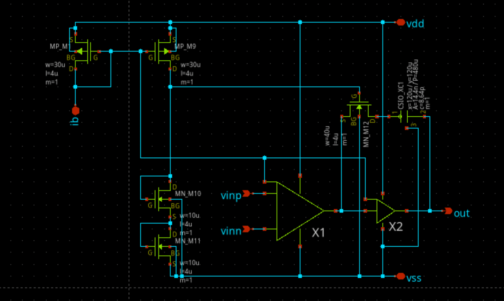
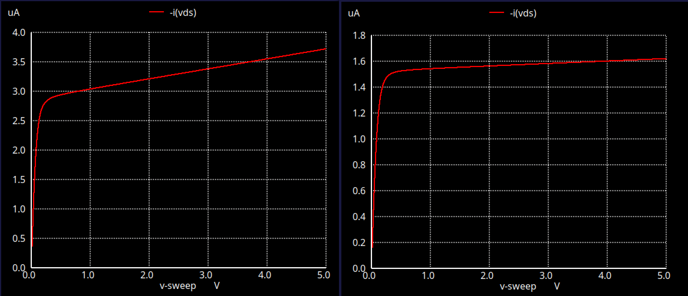
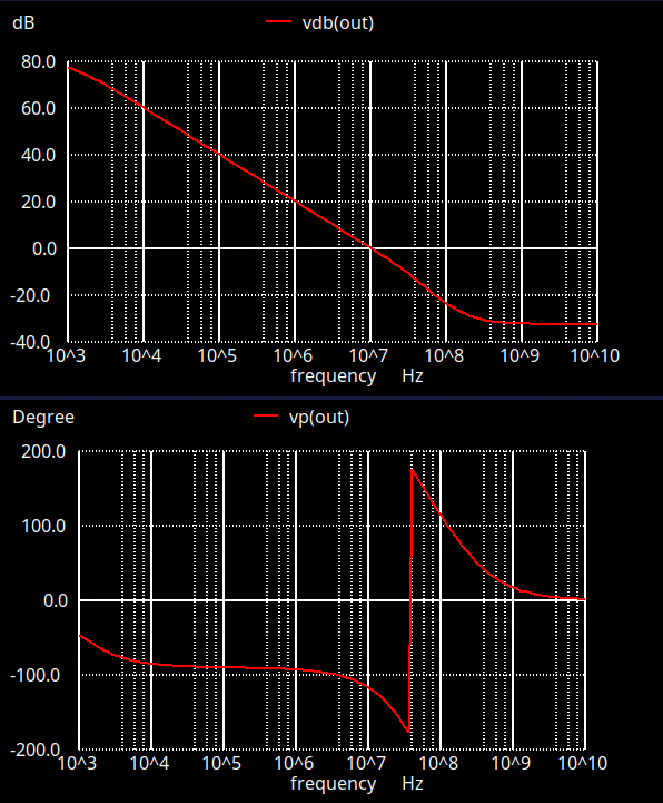
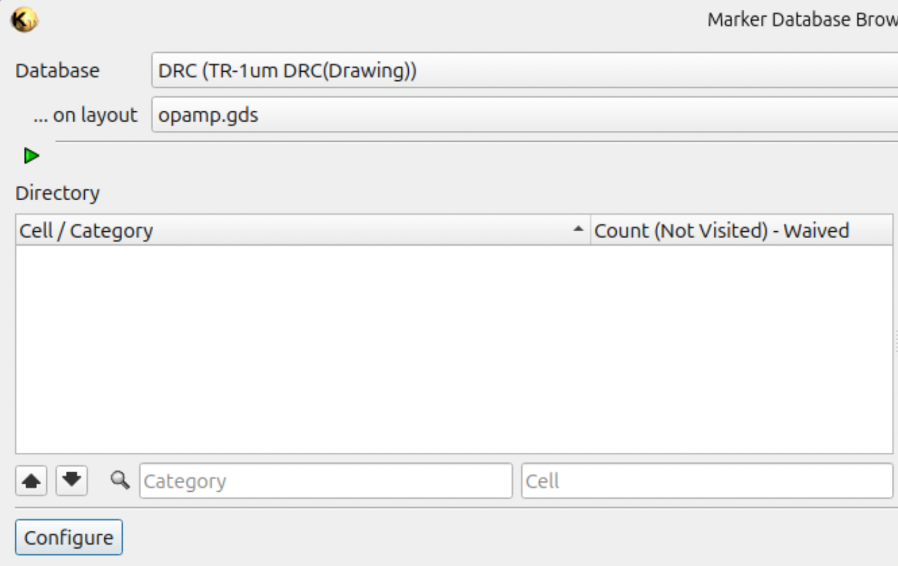
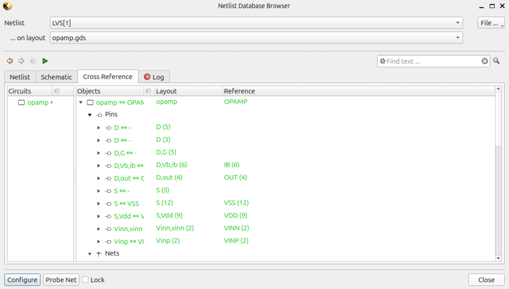

# CMOS Amplifier IC Design

A CMOS amplifier designed from schematic to physical layout as an analog IC design project.

The project focuses on transistor-level analog design, biasing, phase compensation, physical layout, and verification using SPICE, xschem, and KLayout.

  
  

## Project Overview

- Circuit: CMOS amplifier
- Design flow: Schematic → SPICE simulation → Layout → DRC / LVS
- Tools: xschem, ngspice, KLayout
- Focus: Analog IC design and physical layout
- Status: Layout and verification completed

## Circuit Design

The amplifier was designed while considering the operating point, device sizing, gain, biasing, and stability.

The design includes a differential amplifier stage, current-mirror-based biasing, and frequency compensation.

Several transistor dimensions were determined through SPICE simulation rather than using fixed default values.

## Design Considerations

### Channel Length Selection

SPICE simulations were used to evaluate transistor behavior with different channel lengths.

The channel length was increased to **L = 4 µm** to mitigate short-channel effects and to obtain higher output resistance, which helps improve analog gain.

  

Based on the simulation results, **L = 4 µm** was selected as a practical value for this amplifier design.

### Bias Current

The bias current is supplied externally and is intended to be adjustable.

For this reason, no single fixed \(I_{bias}\) value was specified for the design.

This allows the operating point to be adjusted externally depending on the required amplifier characteristics.

### Current Mirror Sizing

The current-mirror transistors were designed with a width of

\[
W = 30\ \mu m
\]

Since the bias current is externally adjustable, the transistor width was not determined from a single fixed current requirement.

Instead, the width was selected to provide sufficient transconductance while balancing device area and parasitic capacitance.

The devices were implemented using multiple fingers to avoid excessively elongated transistor geometries and to obtain a more regular and practical physical layout.

### Output Operating Point

The transistor sizing on the output side was adjusted so that the nominal output voltage is approximately

\[
V_{out} \approx \frac{1}{2}V_{DD}
\]

A sizing ratio of approximately **1:2** between the relevant transistors was selected through simulation to place the operating point near the middle of the supply range.

This provides output headroom in both directions around the nominal operating point.

### Phase Compensation

The compensation network was adjusted through SPICE simulation to improve amplifier stability.

The compensation values were tuned while observing the frequency response so that sufficient phase margin could be obtained and oscillation could be avoided.

  

## Physical Layout

The physical layout was developed primarily using a schematic-to-layout approach.

Several CMOS structures were implemented as reusable layout cells where appropriate.

For transistor pairs requiring good matching, a **common-centroid layout technique** was used.

Double vias were used in selected interconnects to improve physical robustness.

Guard rings were also considered as a possible noise-isolation technique, but were not implemented in this version of the layout.

  

## Verification

The completed layout was verified using both DRC and LVS.

### DRC

Design Rule Checking was performed to verify that the layout satisfies the fabrication design rules.

  

### LVS

Layout Versus Schematic verification was performed to confirm that the extracted layout connectivity matches the intended schematic.

  

## What I Learned

This project was used to deepen my understanding of analog IC design beyond schematic-level circuit operation.

In particular, I gained hands-on experience with transistor sizing, operating-point selection, bias design, phase compensation, device matching, physical layout, and layout verification.

The project also helped me understand how transistor-level circuit decisions affect physical implementation and vice versa.

## Main Files

- `amplifier.sch` — schematic
- `amplifier.gds` — physical layout / GDS
- `docs/` — simulation, layout, DRC, and LVS images
